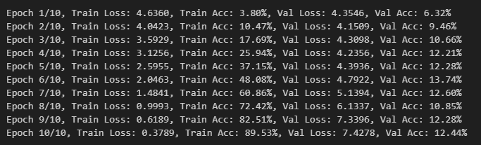

# Dog Breed Classification with PyTorch

This repository contains a PyTorch-based implementation of a dog breed classification model. It leverages both a custom Convolutional Neural Network (CNN) and a pre-trained ResNet18 model to classify images into 120 different dog breeds.

## Table of Contents
- [Features](#features)
- [Setup](#setup)
- [Dataset](#dataset)
- [Model Architecture](#model-architecture)
- [Training and Evaluation](#training-and-evaluation)
- [Results](#results)
- [Usage](#usage)

## Features
- Implements two models:
  - **CustomCNN**: A CNN with residual blocks and adaptive pooling.
  - **ResNet18**: A pre-trained ResNet18 model fine-tuned for dog breed classification.
- Data preprocessing with transformations for data augmentation and normalization.
- Training and validation pipelines with metrics computation.
- Comparison of validation loss and accuracy between the models.
- Visualization of performance metrics.

## Setup
### Prerequisites
Ensure you have Python 3.8+ installed and the following libraries:

- PyTorch
- torchvision
- matplotlib
- scikit-learn

Install the dependencies with:
```bash
pip install -r requirements.txt
```

### Directory Structure
```plaintext
├── dataset
│   └── annotations
│       └── Annotation
│   └── images
│       └── Images  # Directory containing all images
├── docs
│   └── Classification Report.png
│   └── Custom_CNN_Training.png
│   └── Evaluation Val Loss_Val Acc.png
│   └── Resnet_Fine Tune_Training.png
│   └── Val acc Comparison.png
│   └── Val loss Comparison.png
├── models
│   └── stanford_dogs_model_CustomCNN.pth  # Saved CustomCNN model
│   └── stanford_dogs_model_ResNet18.pth   # Saved ResNet18 model
├── main.ipynb  # Main training and evaluation script
└── readme.md  # Project documentation
```

## Dataset
The dataset used is the Stanford Dogs dataset, which contains images of 120 dog breeds. The data should be placed under the `dataset/images/Images` directory.

### Data Splits
- **Training**: 85% of the dataset
- **Validation**: 15% of the dataset

### Data Transformations
- **Training Transformations**:
  - Resize to 224x224
  - Random horizontal flipping
  - Normalize with mean `[0.485, 0.456, 0.406]` and std `[0.229, 0.224, 0.225]`
- **Validation Transformations**:
  - Resize to 224x224
  - Normalize with the same parameters as training

## Model Architecture
### CustomCNN
- Three residual blocks with convolutional layers, batch normalization, and ReLU activations.
- Adaptive average pooling followed by a fully connected layer.

### ResNet18
- A pre-trained ResNet18 model from torchvision with the final fully connected layer replaced to match the number of classes (120).

## Training and Evaluation
### Hyperparameters
- **Batch Size**: 32 (train), 64 (validation)
- **Learning Rate**: 0.001
- **Epochs**: 10
- **Loss Function**: CrossEntropyLoss
- **Optimizer**: Adam

### Training Loop
- Training metrics: Loss and Accuracy
- Validation metrics: Loss and Accuracy
- Models are saved after training.

### Model Evaluation
- Models are evaluated on the validation set, and metrics are reported.
- Classification report generated using scikit-learn.

## Results
### Classification Report


### CustomCNN Training Performance


### ResNet18 Fine-Tuning Performance


### Validation Metrics
- **Validation Loss and Accuracy over Epochs**:


### Performance Comparison
- **Validation Accuracy Comparison**:


- **Validation Loss Comparison**:


## Usage
### Training
Run the main.ipynb:

### Evaluation
Evaluate the saved models:
```python
from main import evaluate_model

val_loss, val_accuracy = evaluate_model(model, val_loader, criterion, device)
print(f"Validation Loss: {val_loss:.4f}, Validation Accuracy: {val_accuracy:.2f}%")
```

### Inference
Use the trained model for inference:
```python
from torchvision import transforms
from PIL import Image

# Load the model
model.load_state_dict(torch.load("models/stanford_dogs_model_ResNet18.pth"))
model.eval()

# Preprocess the image
transform = transforms.Compose([
    transforms.Resize((224, 224)),
    transforms.ToTensor(),
    transforms.Normalize([0.485, 0.456, 0.406], [0.229, 0.224, 0.225])
])

image = Image.open("path_to_image.jpg")
image = transform(image).unsqueeze(0).to(device)

# Predict
output = model(image)
_, predicted = torch.max(output, 1)
print(f"Predicted class: {predicted.item()}")
```