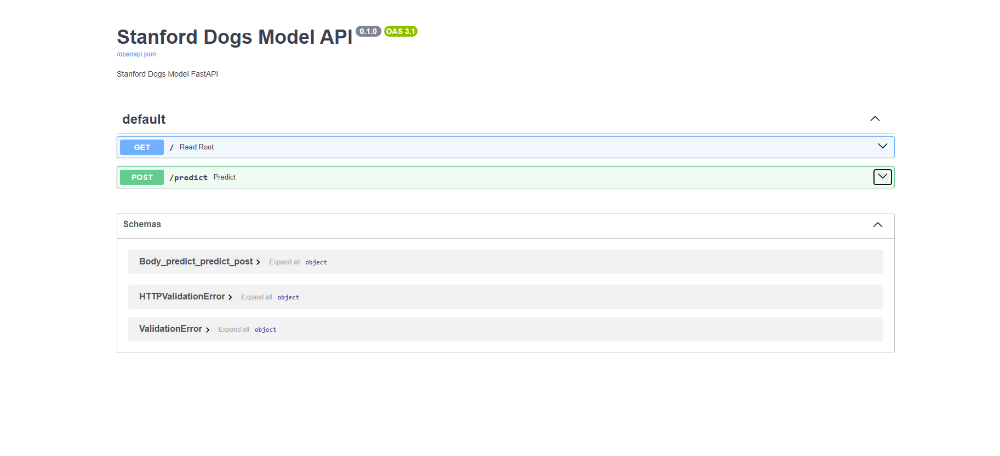
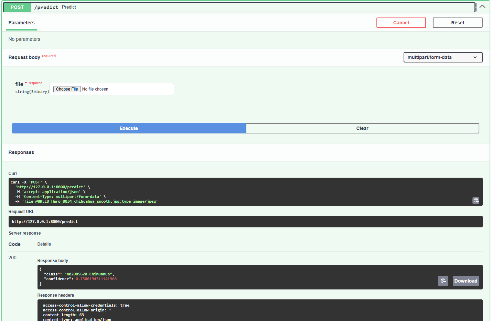

# PyTorch Model Serving with FastAPI

This repository provides a simple API for serving a PyTorch-based model using FastAPI. The API allows you to upload an image and receive predictions from a pre-trained model. The model is a ResNet18 trained on the Stanford Dogs dataset, capable of classifying images into 120 different dog breeds.

## Features

- Image classification using a pre-trained PyTorch model (ResNet18).
- FastAPI-based API for serving the model.
- Returns the predicted class and confidence score for each uploaded image.
- Docker support for easy deployment.

## Requirements

- Python 3.8+
- Docker (for containerization)
- FastAPI
- PyTorch
- torchvision
- Pillow (for image processing)
- uvicorn (for running the FastAPI app)

You can install the dependencies via `requirements.txt`:

```bash
pip install -r requirements.txt
```

## Setup

### 1. Clone the repository

```bash
git clone https://github.com/masdewaa/pytorch-fastapi-model-serving.git
cd pytorch-fastapi-model-serving
```

### 2. Prepare the model

- Ensure you have a pre-trained model `.pth` file (e.g., `stanford_dogs_model_ResNet18.pth`).
- Place the model file in the `models/` directory.
- Create a `class_labels.json` file containing the class names (dog breeds) associated with the model. The file should have a structure like:

```json
{
    "0": "n02085620-Chihuahua",
    "1": "n02085782-Japanese_spaniel",
    ...
}
```

### 3. Running the application locally

To run the application locally using Uvicorn:

```bash
uvicorn app:app --reload
```

This will start the FastAPI server on http://127.0.0.1:8000.

### 4. API Endpoints

#### 1. Root endpoint
The root endpoint returns a welcome message.

- **URL**: `/`
- **Method**: `GET`
- **Response**:

```json
{
    "message": "Welcome to the CNN Classifier API using PyTorch!"
}
```

#### 2. Predict endpoint
The `predict` endpoint accepts an image file and returns the predicted class and confidence score.

- **URL**: `/predict`
- **Method**: `POST`
- **Request**: Upload an image file (`multipart/form-data`).
- **Response**:

```json
{
    "class": "n02085620-Chihuahua",
    "confidence": 0.9482
}
```

### 5. Dockerization (Optional)

To run the FastAPI app in a Docker container, follow these steps:

#### 1. Build the Docker image

First, make sure your Dockerfile and other files are properly set up. Then build the Docker image using the following command:

```bash
docker build -t fastapi-pytorch-app .
```

#### 2. Run the Docker container

After building the Docker image, you can run the application inside a Docker container:

```bash
docker run -d -p 8000:8000 --name fastapi-pytorch-container fastapi-pytorch-app
```

This will start the app inside a Docker container and expose the FastAPI server at http://localhost:8000.

## Documentation Screenshots

To provide a better understanding of the API functionality, the following screenshots are included in the `/docs` folder:

- **Swagger UI**: The `ss_swagger.png` file shows the Swagger UI for the API.
- **Testing Response**: The `testing_respon.png` file shows an example of the response from the `/predict` endpoint.

### Example Screenshot: Swagger UI


### Example Screenshot: Testing Response

